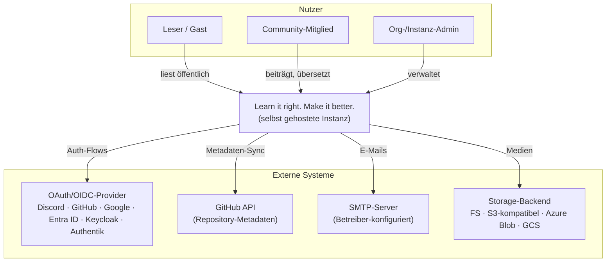
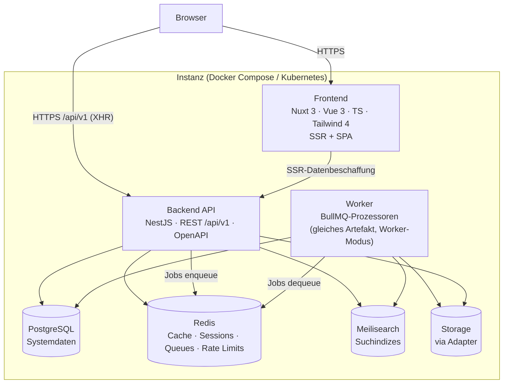

# Systemüberblick

**Status:** Verbindlich · **Version:** 1.0 · **Stand:** 2026-07-20

## 1. Architekturprinzipien

1. **Modularer Monolith mit service-orientierter Binnenstruktur**
   (→ [ADR-0001](decisions/adr-0001-modular-monolith.md)): ein deploybares Backend-Artefakt,
   intern in 12 Module mit harten Grenzen gegliedert. Begründung: einfache Entwicklung, einfache
   Self-Hosting-Installation, klare Grenzen, spätere Skalierung möglich.
2. **Self-Hosting first:** Jede Architekturentscheidung muss auf einer Single-Node-Referenz
   (4 vCPU / 8 GB) betreibbar bleiben. Keine Pflicht-Cloud-Dienste.
3. **Eine Codebasis, Konfiguration statt Editionen**
   (→ [ADR-0009](decisions/adr-0009-single-codebase-no-editions.md)).
4. **Abstraktion an den Rändern:** Auth-Provider, Storage-Backends und Notification-Kanäle sind
   austauschbare Adapter hinter stabilen Interfaces
   (→ [ADR-0007](decisions/adr-0007-storage-abstraction.md)).
5. **Sicherheit als Grundzustand:** Deny-by-default-Autorisierung, serverseitige Validierung,
   verschlüsselte Secrets, auditierte Admin-Aktionen (→ [security/](../security/README.md)).
6. **Asynchron, wo es der Nutzer nicht spürt:** E-Mails, Suche-Indexierung, Media-Verarbeitung
   und GitHub-Sync laufen als Hintergrundjobs (→ [ADR-0006](decisions/adr-0006-redis-bullmq.md)).

## 2. Kontextsicht (C4 Level 1)



## 3. Containersicht (C4 Level 2)



**Hinweise:**

- Frontend und Backend sind getrennte Container; das Frontend rendert serverseitig und spricht
  dafür intern die Backend-API an. Der Browser spricht die API direkt (Cookies, CORS same-site
  über Reverse Proxy, → [deployment/01](../deployment/01-environments-topologies.md)).
- **Worker** ist dasselbe Backend-Artefakt im Modus `WORKER=true` — kein eigener Code-Stand
  (→ [04-backend-architecture.md §7](04-backend-architecture.md)).
- PostgreSQL und Redis sind **harte** Laufzeitabhängigkeiten; Meilisearch, SMTP und Storage
  degradieren kontrolliert (→ [NFR-014](../requirements/04-non-functional-requirements.md)).

## 4. Backend-Binnenstruktur (C4 Level 3, Kurzfassung)

```
Frontend
   |
API Layer (Controller · Guards · OpenAPI)
   |
Backend Core (Module)
--------------------------------------------------------------
identity · authorization · profile · knowledge · translation
organization · search · repository · media · notification
audit · configuration
--------------------------------------------------------------
Infrastructure Layer (Prisma · Redis · BullMQ · Meilisearch ·
Storage-Adapter · Mailer · HTTP-Clients)
```

Details und Abhängigkeitsregeln: [02-module-boundaries.md](02-module-boundaries.md).

## 5. Verbindlicher Techstack

| Ebene | Technologie | ADR |
|---|---|---|
| Frontend-Framework | **Nuxt 3** (Vue 3, Composition API), TypeScript durchgehend | [ADR-0002](decisions/adr-0002-nuxt-frontend.md) |
| Styling | **Tailwind CSS 4** + CSS Variables + Design Tokens; eigene Component Library | [ADR-0002](decisions/adr-0002-nuxt-frontend.md) |
| Backend-Framework | **NestJS** (Node.js 22 LTS), TypeScript | [ADR-0003](decisions/adr-0003-nestjs-backend.md) |
| API | **REST** `/api/v1`, OpenAPI 3.1, Versionierung; WebSocket/Events vorbereitet | [api/](../api/README.md) |
| Datenbank | **PostgreSQL 17** | [ADR-0004](decisions/adr-0004-postgresql-prisma.md) |
| ORM | **Prisma** (Typensicherheit, Migrationen) | [ADR-0004](decisions/adr-0004-postgresql-prisma.md) |
| Suche | **Meilisearch 1.x** | [ADR-0005](decisions/adr-0005-meilisearch.md) |
| Cache/Queues | **Redis 7** + **BullMQ** | [ADR-0006](decisions/adr-0006-redis-bullmq.md) |
| Media-Processing | **Sharp** | [services/media](../services/media-service.md) |
| Storage | Adapter: Filesystem, S3-kompatibel (Hetzner, AWS, MinIO, R2), Azure Blob, GCS | [ADR-0007](decisions/adr-0007-storage-abstraction.md) |
| AuthZ | Hybrid **RBAC + ABAC** | [ADR-0008](decisions/adr-0008-hybrid-rbac-abac.md) |
| Sessions | Serverseitig (Redis), HTTP-only Cookies | [ADR-0011](decisions/adr-0011-session-auth-server-side.md) |
| Content-Format | Markdown (CommonMark + GFM + Admonitions) | [ADR-0012](decisions/adr-0012-markdown-content-format.md) |
| Monorepo | **pnpm workspaces + Turborepo** | [ADR-0010](decisions/adr-0010-monorepo-pnpm-turborepo.md) |
| Dev-Umgebung | Docker Compose: Frontend, Backend, PostgreSQL, Redis, Meilisearch, MinIO, Mailhog | [deployment/02](../deployment/02-docker-compose.md) |

## 6. Qualitätsattribute mit Architekturbezug

| Attribut | Architekturmittel |
|---|---|
| Installierbarkeit | Ein Compose-File, Setup Wizard, keine externen Pflichtdienste |
| Skalierbarkeit | Stateless API/Worker, Sessions in Redis, horizontale Replikation, später Modul-Extraktion (→ [06](06-scalability-evolution.md)) |
| Wartbarkeit | Modulgrenzen mit Lint-Enforcement, Shared Types, ADR-Prozess |
| Sicherheit | Guard-Pipeline, zentrale Policy-Evaluation, Verschlüsselungsschicht, Audit-Hooks |
| Erweiterbarkeit | Provider-Adapter (Auth, Storage, Notification, Repository), Domain Events |
