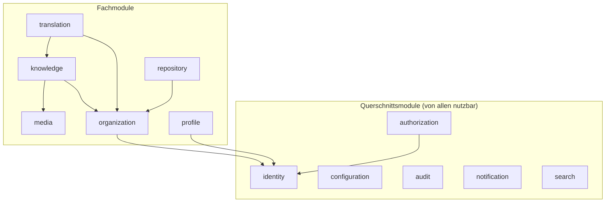

# Modulgrenzen & Kommunikationsregeln

**Status:** Verbindlich · **Version:** 1.0 · **Stand:** 2026-07-20

## 1. Die 12 Backend-Module

Das Backend besteht aus genau diesen Modulen (NestJS-Module unter `apps/backend/src/modules/`):

| Modul | Verantwortung (Kurzform) | Doku |
|---|---|---|
| `identity` | Benutzerkonten, Auth-Provider, Sessions, MFA, PATs | [services/identity](../services/identity-service.md) |
| `authorization` | Rollen, Gruppen, Permissions, ABAC-Policies, Zugriffsentscheidung | [services/authorization](../services/authorization-service.md) |
| `profile` | Entwicklerprofile, Reputation, Achievements | [services/profile](../services/profile-service.md) |
| `knowledge` | Spaces, Kategorien, Artikel, Versionen, Reviews, Kommentare, Tags | [services/knowledge](../services/knowledge-service.md) |
| `translation` | Übersetzungen, Übersetzungs-Reviews, Sprachen | [services/translation](../services/translation-service.md) |
| `organization` | Organisationen, Mitglieder, Teams, Einladungen | [services/organization](../services/organization-service.md) |
| `search` | Meilisearch-Anbindung, Indexierung, Suchabfragen | [services/search](../services/search-service.md) |
| `repository` | Projekte, Repository-Verknüpfung, GitHub-Sync | [services/repository](../services/repository-service.md) |
| `media` | Upload-Pipeline, Verarbeitung, Storage-Abstraktion | [services/media](../services/media-service.md) |
| `notification` | In-App-Notifications, E-Mail-Versand, Webhooks (vorbereitet) | [services/notification](../services/notification-service.md) |
| `audit` | Append-only Audit-Log | [services/audit](../services/audit-service.md) |
| `configuration` | Instanzeinstellungen, Modul-Flags, Setup Wizard, Secret-Verschlüsselung | [services/configuration](../services/configuration-service.md) |

> **Abweichung vom Fachkonzept:** Das Konzept (§6) listet 11 Module; `profile` ist als 12. Modul
> ergänzt, um Konzept-Kapitel 11 (Entwicklerprofile, Reputation, Achievements) einen klaren
> Eigentümer zu geben, statt es über `identity`/`knowledge` zu verschmieren. Begründung und
> Konsequenzen: [services/README.md](../services/README.md).

## 2. Modul-Anatomie

Jedes Modul folgt derselben inneren Struktur (→ [04-backend-architecture.md](04-backend-architecture.md)):

```
modules/<modul>/
├── <modul>.module.ts        -- NestJS-Modul, deklariert Provider & Exporte
├── api/                     -- Controller + Request/Response-DTOs (Zod)
├── application/             -- Use-Case-Services (öffentliche Fachlogik)
├── domain/                  -- Entitäten, Value Objects, Domain Events, Fachregeln
├── infrastructure/          -- Prisma-Repositories, externe Clients, Adapter
└── index.ts                 -- ÖFFENTLICHE Schnittstelle des Moduls (einzige Import-Quelle)
```

**Regel M-1 (MUSS):** Andere Module importieren ausschließlich aus `modules/<modul>` (dem
`index.ts`) — niemals aus Unterpfaden (`modules/<modul>/domain/...`). Erzwungen per
ESLint-Regel (`no-restricted-imports` / dependency-cruiser, → [development-guidelines/02](../development-guidelines/02-coding-standards.md)).

**Regel M-2 (MUSS):** Der `index.ts` exportiert nur: Application-Services (Ports), Domain-Event-
Definitionen und öffentliche Typen. Niemals Prisma-Modelle, Repositories oder Controller.

## 3. Erlaubte Abhängigkeiten



Vollständige Abhängigkeitsmatrix (Zeile darf Spalte **direkt aufrufen**):

| von \ nach | idnt | autz | conf | audt | noti | srch | orga | know | tran | repo | medi | prof |
|---|---|---|---|---|---|---|---|---|---|---|---|---|
| **identity** | — | ✔¹ | ✔ | ✔ | ✔ | | | | | | ✔² | |
| **authorization** | ✔ | — | ✔ | ✔ | | | ✔³ | | | | | |
| **profile** | ✔ | ✔ | ✔ | ✔ | | | | | | | ✔² | |
| **knowledge** | ✔ | ✔ | ✔ | ✔ | ✔ | ✔⁴ | ✔ | — | | | ✔ | |
| **translation** | ✔ | ✔ | ✔ | ✔ | ✔ | ✔⁴ | ✔ | ✔ | — | | | |
| **organization** | ✔ | ✔ | ✔ | ✔ | ✔ | | — | | | | ✔² | |
| **search** | ✔ | ✔ | ✔ | | | — | | ✔⁵ | ✔⁵ | ✔⁵ | | |
| **repository** | ✔ | ✔ | ✔ | ✔ | ✔ | ✔⁴ | ✔ | | | — | ✔² | |
| **media** | ✔ | ✔ | ✔ | ✔ | | | ✔ | | | | — | |
| **notification** | ✔ | | ✔ | ✔ | | | | | | | | |
| **audit** | | | ✔ | — | | | | | | | | |
| **configuration** | | | — | ✔ | | | | | | | | |

¹ nur Guard-/Decision-Aufrufe · ² nur Avatar-/Logo-Verwaltung · ³ Auflösung von
Org-Mitgliedschaften als Attribute · ⁴ nur `enqueueIndex`-Port · ⁵ nur Read-Ports zum
Dokumentaufbau beim (Re-)Indexieren

**Regel M-3 (MUSS):** Zyklen sind verboten. Wo die Matrix keine direkte Kante erlaubt,
kommunizieren Module über **Domain Events** (unten) — z. B. kennt `knowledge` das Modul
`profile` nicht; Reputation entsteht durch Event-Konsum.

**Regel M-4 (MUSS):** `audit` und `notification` werden von Fachmodulen nur **schreibend** über
schmale Ports angesprochen (`audit.record(...)`, `notification.dispatch(...)`); sie rufen ihrerseits
nie Fachmodule auf (Ausnahme: Notification liest Empfänger-Präferenzen und E-Mail via `identity`).

## 4. Kommunikationsmuster

| Muster | Wann | Mechanik |
|---|---|---|
| **Direkter Port-Aufruf** | Synchron benötigtes Ergebnis, Kante in Matrix erlaubt | Import des Application-Service über Modul-Index; DI via NestJS |
| **Domain Event (in-process)** | Reaktionen ohne Rückgabewert, lose Kopplung | NestJS `EventEmitter2`; Event-Klassen im publizierenden Modul definiert |
| **Hintergrundjob (BullMQ)** | Zuverlässig/verzögert/teuer: Mail, Indexierung, Media, Sync | Event-Handler oder Service enqueued Job; Worker verarbeitet (→ [ADR-0006](decisions/adr-0006-redis-bullmq.md)) |

**Regel M-5 (MUSS):** Ein Domain Event wird **nach** erfolgreichem DB-Commit der auslösenden
Transaktion publiziert. Handler, deren Wirkung verlässlich sein muss (Indexierung, Mails,
Reputation), legen daraus **sofort einen BullMQ-Job** an — die Job-Queue ist der
Zuverlässigkeitsanker (Retry, Backoff, Dead-Letter), nicht der In-Process-Bus.

**Regel M-6 (MUSS):** Alle Job-Handler sind **idempotent** (Job-IDs deterministisch, z. B.
`index:article:<id>:<versionId>`), da BullMQ At-least-once liefert.

## 5. Domain-Event-Katalog (Kernereignisse)

Naming: `<modul>.<entität>.<verb-perfekt>`. Payload: IDs + minimale Fakten, keine kompletten
Entitäten. Vollständige Payload-Definitionen in den Service-Dokus.

| Event | Publiziert von | Typische Konsumenten |
|---|---|---|
| `identity.user.registered` | identity | notification (Verifizierungsmail), profile (Profil anlegen), audit |
| `identity.user.deleted` | identity | alle Module (Anonymisierung), search (De-Indexierung) |
| `identity.session.revoked` | identity | audit |
| `identity.mfa.enabled` / `identity.mfa.recovery_code_used` | identity | notification, audit |
| `authorization.assignment.changed` | authorization | audit, search (Sichtbarkeitsupdate) |
| `knowledge.article.submitted` | knowledge | notification (Review benötigt) |
| `knowledge.article.published` | knowledge | search (Index), translation (Outdated-Prüfung), profile (Reputation), notification (Watcher) |
| `knowledge.article.archived` | knowledge | search (De-Index/Flag) |
| `knowledge.review.completed` | knowledge | notification (Autor), profile (Reputation Reviewer) |
| `knowledge.comment.created` | knowledge | notification (Beteiligte), search |
| `translation.translation.published` | translation | search, profile, notification |
| `translation.translation.outdated` | translation | notification (Translator, Language Maintainer) |
| `organization.member.joined` / `left` | organization | authorization (Cache-Invalidierung), audit |
| `repository.sync.completed` / `failed` | repository | search (Projekt-Index), notification (bei Fehlern an Owner) |
| `media.object.ready` / `media.object.rejected` | media | knowledge (Platzhalter auflösen), audit (rejected) |
| `configuration.settings.changed` | configuration | betroffene Module (Cache-Invalidierung), audit |

## 6. Shared Kernel

Modulübergreifend geteilter Code lebt **nur** an diesen Orten:

| Ort | Inhalt |
|---|---|
| `packages/shared-types` | Zod-Schemas + TS-Typen der API-Contracts, Enums (Locales, Statuswerte), Event-Payload-Typen — genutzt von Backend **und** Frontend |
| `apps/backend/src/common/` | Framework-Querschnitt: Guards, Interceptors, Filters, Logger, Prisma-Service, Redis-Service, Pagination-Helfer, Crypto (Feldverschlüsselung) |

**Regel M-7 (MUSS):** `common/` enthält **keine Fachlogik** und importiert **niemals** aus
`modules/`. Fachbegriffe (Article, Role, …) existieren dort nicht.

## 7. Modul-Deaktivierung (Feature-Flags)

Für per Konfiguration abschaltbare Module (`organization`, `translation`, `repository`,
Kommentare, Achievements — → FR-CONF-004) gilt:

- Controller deaktivierter Module antworten `404` mit Code `module_disabled`
  (globaler `ModuleEnabledGuard`).
- Event-Handler deaktivierter Module sind no-ops; Jobs werden nicht enqueued.
- Kernmodule (`identity`, `authorization`, `configuration`, `audit`, `knowledge`, `media`,
  `search`, `notification`) sind **nicht** deaktivierbar.
