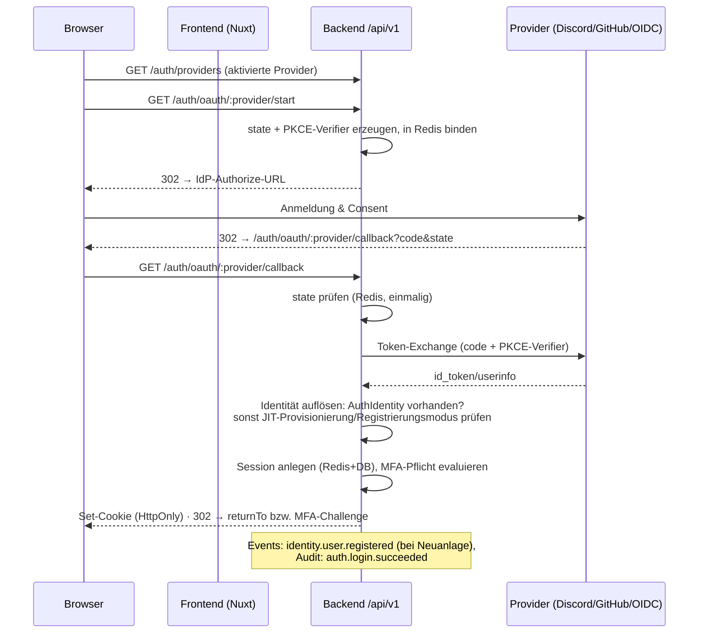
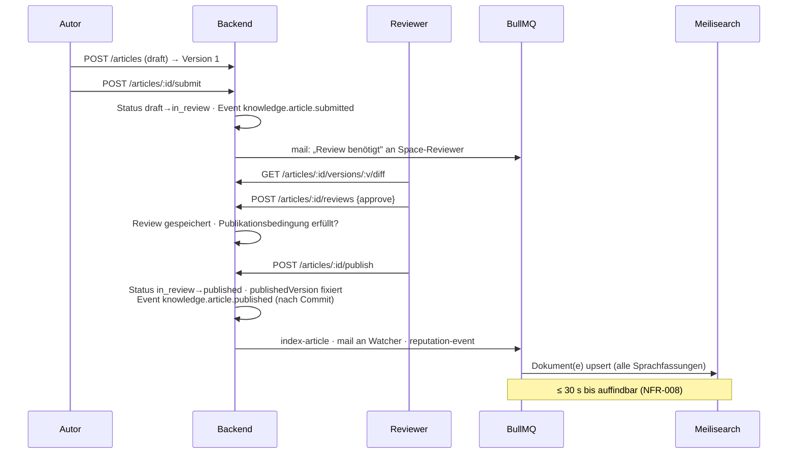
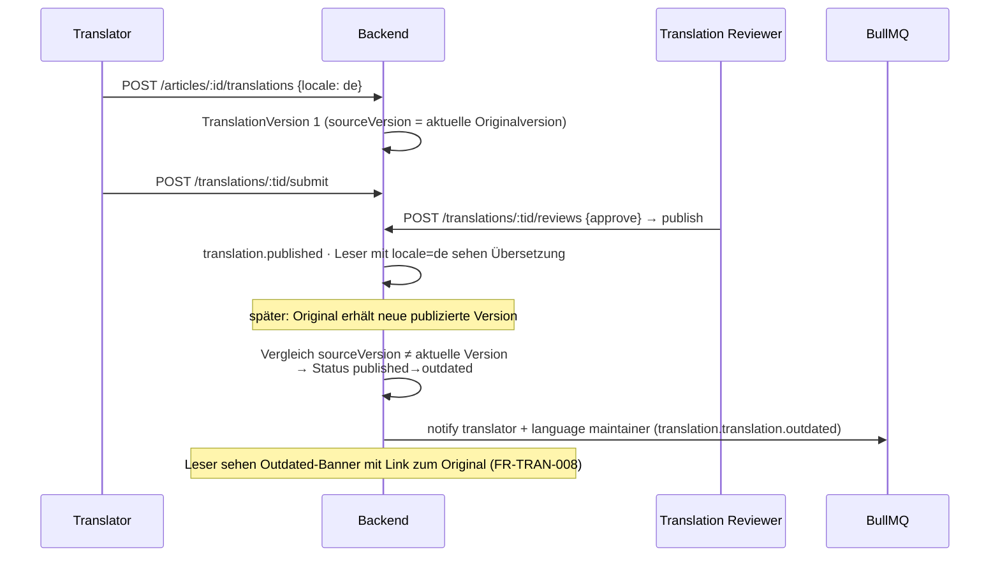
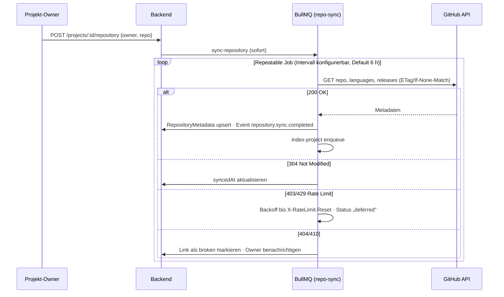
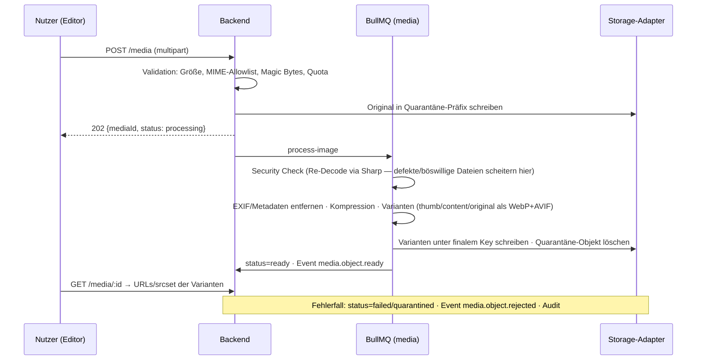
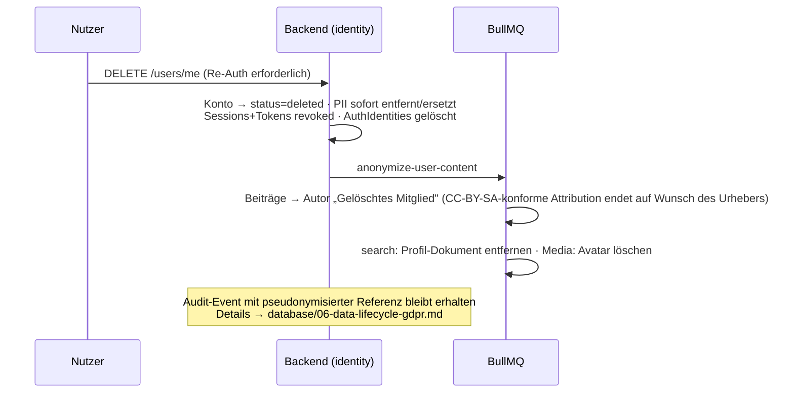

# Zentrale Datenflüsse

**Status:** Verbindlich · **Version:** 1.0 · **Stand:** 2026-07-20

Sequenzdiagramme der architekturprägenden Abläufe. Fachliche Detailregeln stehen in den
jeweiligen [Service-Dokus](../services/README.md).

## 1. OAuth/OIDC-Login (Authorization Code + PKCE)



## 2. Artikel-Publikation (Review-Workflow)



## 3. Übersetzung inkl. Outdated-Kaskade



## 4. GitHub-Repository-Sync



## 5. Media-Upload-Pipeline



## 6. Suche (Query-Pfad mit Berechtigungen)

```mermaid
sequenceDiagram
    participant B as Browser
    participant API as Backend (search)
    participant MS as Meilisearch

    B->>API: GET /search?q=…&filters=…
    API->>API: Sichtbarkeitskontext bestimmen:<br/>public | + interne | + Space-/Org-IDs des Nutzers
    API->>MS: Query mit Filter visibility IN (…) AND spaceId IN (…)
    MS-->>API: Treffer + Facetten
    API-->>B: Ergebnisse (ohne nachträgliches Filtern — Filter sind Teil der Query)
    Note over API,MS: Dokumente tragen denormalisierte Sichtbarkeitsfelder;<br/>Änderungen an Space-Sichtbarkeit → Reindex des Space (Job)
```

## 7. Konto-Löschung (DSGVO)


