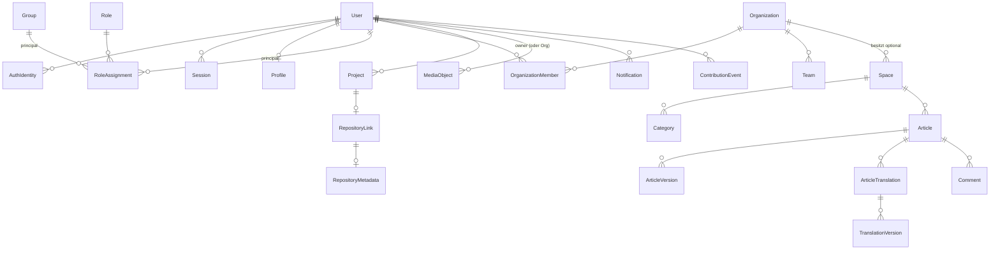

# Datenmodell — Überblick & Konventionen

**Status:** Verbindlich · **Version:** 1.0 · **Stand:** 2026-07-20

## 1. Domänenschnitt

Ein Prisma-Schema (`apps/backend/prisma/schema.prisma`), gegliedert in kommentierte Blöcke pro
Modul. Tabellen-Ownership folgt der Modulgrenze
(→ [architecture/02](../architecture/02-module-boundaries.md)); Details je Modul in
[schemas/](schemas/README.md).

## 2. Gesamt-ERD (vereinfacht — nur Kernbeziehungen)

## 3. Verbindliche Modellierungskonventionen

### Identität & Schlüssel

- **K-DB-1:** Primärschlüssel: `id` als **UUIDv7** (zeitlich sortierbar, index-freundlich),
  erzeugt in der Anwendung (`uuidv7()`-Helfer in `common/`), Prisma-Typ `String @db.Uuid`.
- **K-DB-2:** Natürliche Schlüssel (Handle, Slug, E-Mail) sind `UNIQUE`-Spalten neben der
  UUID — niemals selbst PK (Änderbarkeit).
- **K-DB-3:** Fremdschlüssel immer mit explizitem `onDelete`-Verhalten im Schema; Default ist
  `Restrict` — `Cascade` nur, wo die Spezifikation es fordert (z. B. Versionen mit Artikel).

### Zeit & Lebenszyklus

- **K-DB-4:** `createdAt` (`@default(now())`) und `updatedAt` (`@updatedAt`) als `timestamptz`
  auf jeder Tabelle; fachliche Zeitpunkte (z. B. `publishedAt`) zusätzlich explizit.
- **K-DB-5:** Soft-Delete (`deletedAt`) **nur** wo spezifiziert (MediaObject, Organization im
  14-Tage-Fenster); Standard ist echtes Löschen bzw. Statusfelder (`archived`).
- **K-DB-6:** Append-only-Tabellen (`AuditEvent`, `ContributionEvent`, `ReputationLedger`,
  `ArticleVersion`, `TranslationVersion`): kein UPDATE fachlicher Felder — Korrekturen sind
  neue Zeilen.

### Typen & Werte

- **K-DB-7:** Enums als **Prisma-Enums** (DB-native), Werte `snake_case`
  (`in_review`, `oss_knowledge`); Erweiterung per Migration.
- **K-DB-8:** JSONB (`Json`) nur für: Provider-/Policy-Konfigurationen, Varianten-/
  Metadaten-Strukturen, Settings — immer mit Zod-Schema in `shared-types` validiert. Keine
  fachlichen Beziehungen in JSON verstecken.
- **K-DB-9:** Text-Limits werden in der Anwendung (Zod) erzwungen; DB nutzt `TEXT`
  (kein `VARCHAR(n)`-Mikromanagement), Ausnahmen: Keys/Slugs/Locales mit definierter Länge.
- **K-DB-10:** Geld/Zahlen: keine Float-Spalten für zählbare Werte; `Int`/`BigInt`.

### Namen

- **K-DB-11:** Prisma-Modelle `PascalCase`, DB-Tabellen `snake_case` Plural via
  `@@map("users")`; Spalten `camelCase` im Client, `snake_case` in DB via `@map`.
- **K-DB-12:** Join-Tabellen benannt nach beiden Seiten (`article_tags`), mit eigener
  UUID-PK nur bei Zusatzattributen, sonst zusammengesetzter PK.

### Indizes & Performance

- **K-DB-13:** Jeder in der Schema-Referenz gelistete Index ist im Prisma-Schema deklariert
  (`@@index`/`@@unique`); zusätzliche Indizes brauchen einen Kommentar mit Query-Bezug.
- **K-DB-14:** Case-insensitive Eindeutigkeit (E-Mail, Handle, Slug) über generierte
  Lower-Spalten bzw. `citext`-freie Lösung: Anwendung normalisiert auf lowercase **vor** dem
  Schreiben (eine Wahrheit, keine DB-Magie).
- **K-DB-15:** Listen-Queries sind cursor-paginierbar (Sortierung über `id` UUIDv7 oder
  explizite `createdAt,id`-Kombination) — kein OFFSET auf großen Tabellen
  (→ [api/01](../api/01-api-conventions.md)).

### Sicherheit

- **K-DB-16:** Verschlüsselte Spalten (Suffix `Enc`, Typ `Bytes`): TOTP-Secrets,
  OAuth-Client-Secrets, Provider-Refresh-Tokens, verschlüsselte Settings — Format
  `keyId || nonce || ciphertext || tag` (→ [security/04](../security/04-data-protection-privacy.md)).
- **K-DB-17:** Token-Spalten (Sessions, PATs, Einladungen, E-Mail-Tokens, Recovery Codes)
  speichern **nur Hashes** (SHA-256 bzw. Argon2id für Recovery Codes) — nie Klartext.

## 4. Größenordnungen (Dimensionierung)

| Tabelle | Erwartung Referenzinstanz (NFR-006) | Konsequenz |
|---|---|---|
| `article_versions` | 50.000+ | Content-Spalten TOAST-freundlich; Diff on-demand, nicht materialisiert |
| `audit_events` | 1 M+/Jahr | BRIN-Index auf `occurredAt`, Retention-Job, Partitionierung erst bei Bedarf (>10 M) |
| `contribution_events` / `reputation_ledger` | 500 k+ | Append-only, Summary materialisiert |
| `sessions` | 10 k aktiv | Redis primär, DB-Spiegel mit GC |
| `notifications` | 1 M+ | 90-Tage-TTL-Job, Index (`userId`, `readAt`) |
