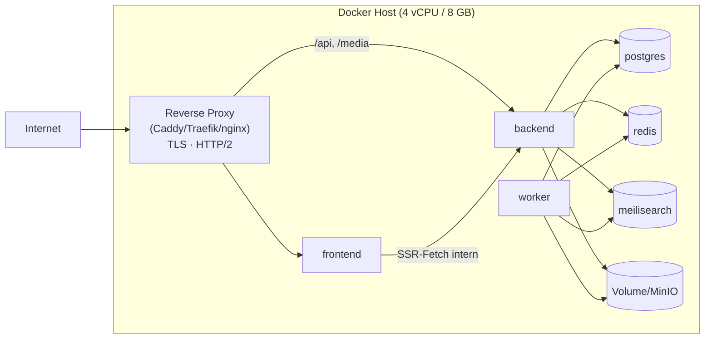

# Umgebungen & Referenztopologien

**Status:** Verbindlich · **Version:** 1.0 · **Stand:** 2026-07-20

## 1. Umgebungen

| Umgebung | Zweck | Setup |
|---|---|---|
| **Lokal (Dev)** | Entwicklung | Compose-Dev-Stack (PG, Redis, Meilisearch, MinIO, Mailhog); Frontend/Backend via `pnpm dev` auf dem Host (HMR) oder vollständig containerisiert |
| **CI** | Tests | Testcontainers bzw. Service-Container in Actions ([testing/02](../testing/02-backend-testing.md)) |
| **Staging** (empfohlen) | Release-Verifikation, Übungen | produktionsgleiche Compose-/K8s-Topologie mit Seed-Daten; CSP report-only |
| **Produktion** | Betrieb | Topologie A oder B (unten) |

## 2. Prozessmodell (in jeder Topologie identisch)

| Prozess | Inhalt | Skalierung |
|---|---|---|
| `frontend` | Nuxt (SSR + Assets) | horizontal, stateless |
| `backend` | NestJS API | horizontal, stateless (Sessions in Redis) |
| `worker` | gleiches Backend-Image, `WORKER=true` | horizontal; queue-spezifische Pools möglich |
| `migrate` | `prisma migrate deploy` + base-Seed | einmalig je Deploy, **vor** backend/worker |

## 3. Topologie A — Single Node (Referenz, NFR-006)

- **Routing:** `/_nuxt/**`, Seiten → frontend; `/api/**`, `/media/**`, `/metrics`(intern),
  `/healthz|readyz` → backend. Ein Origin ⇒ First-Party-Cookies, kein CORS (F-Architektur).
- Nur der Proxy exponiert Ports; alle Dienste im internen Compose-Netz.
- Storage: lokales Volume (`filesystem`-Adapter) oder externes S3; MinIO optional als
  Container für S3-on-node.

## 4. Topologie B — Kubernetes (skaliert)

Ingress (TLS) → Services `frontend` (≥ 2), `backend` (≥ 2), Worker-Deployments je
Queue-Gruppe; PostgreSQL als Operator/Managed, Redis als Managed/Sentinel, Meilisearch
StatefulSet (1 Replica + Backup via Reindex-Fähigkeit), Storage = S3-kompatibel extern.
Details: [03-kubernetes.md](03-kubernetes.md). Entspricht Evolutionsstufe 3
([architecture/06](../architecture/06-scalability-evolution.md)).

## 5. Externe Abhängigkeiten je Umgebung

| Dienst | Dev | Produktion |
|---|---|---|
| SMTP | Mailhog (UI :8025) | Betreiber-SMTP (SPF/DKIM → [Runbook Monitoring](runbooks/monitoring-alerting.md)) |
| OAuth-Provider | Test-Apps der Provider (localhost-Redirects) | produktive Client-IDs, exakte Redirect-URIs |
| S3 | MinIO-Container | Hetzner/AWS/R2/MinIO extern |

## 6. DNS/Proxy-Anforderungen

Eine öffentliche Domain (`APP_URL`); WebSocket-Upgrade-Fähigkeit des Proxys (für spätere
SSE/WS-Aktivierung unkritisch bzw. vorbereitet); `client_max_body_size` ≥ Upload-Limit + Puffer
(Default 12 MB); Forwarded-Header (`X-Forwarded-For/Proto`) gesetzt — Backend vertraut nur dem
konfigurierten Proxy (`TRUST_PROXY`).
