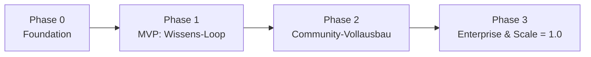

# Roadmap & Meilensteine

**Status:** Verbindlich · **Version:** 1.0 · **Stand:** 2026-07-20

Die Roadmap ordnet alle Anforderungen vier Phasen zu. Phasen sind **inhaltlich** definiert
(Meilenstein = überprüfbares Ergebnis), nicht kalendarisch — die Terminplanung erfolgt im
Projektmanagement des Teams.

## Phase 0 — Foundation

**Meilenstein M0:** Monorepo baut, CI läuft, „Hello Platform" deployt per Compose.

| Ergebnis | Inhalt |
|---|---|
| Monorepo | pnpm + Turborepo, Struktur nach [development-guidelines/01](../development-guidelines/01-repository-structure.md) |
| CI/CD-Grundgerüst | Lint, Typecheck, Tests, Build; Security-Scans (→ [security/06](../security/06-secure-development-pipeline.md)) |
| Design-System-Basis | Tokens, Kernkomponenten (Button, Input, Modal, Table), Dark Mode, Dokumentation (E-14) |
| Backend-Skelett | NestJS-Module angelegt, Prisma-Setup, Config-Loading, Health-Endpoints |
| Frontend-Skelett | Nuxt 3, Layouts, i18n-Setup, API-Client |
| Dev-Umgebung | Docker Compose mit PostgreSQL, Redis, Meilisearch, MinIO, Mailhog |

## Phase 1 — MVP: Der Wissens-Loop

**Meilenstein M1:** Eine öffentliche Community-Instanz kann produktiv betrieben werden:
registrieren → schreiben → reviewen → publizieren → finden.

| Epic | Umfang in Phase 1 |
|---|---|
| E-01 | Setup Wizard komplett (FR-CONF-001…003, 005…007) |
| E-02 | Lokale Auth + E-Mail-Verifizierung + Passwort-Reset; Discord + GitHub OAuth; Registrierungsmodi; Admin-Benutzerverwaltung |
| E-03 | RBAC-Kern: Permission-Katalog, Systemrollen, Scopes, Deny-by-default-Guards |
| E-04 | Artikeltypen, Markdown-Pipeline, Versionierung, Lifecycle, Review, Diff, Spaces, Kategorien, Tags, Slugs |
| E-06 | Artikelsuche mit Facetten, berechtigungsbewusst, Reindex; SEO/SSR |
| E-07 | Profil-Basis (FR-PROF-001), Handles |
| E-10 | Media-Pipeline komplett für FS + S3 |
| E-11 | SMTP + transaktionale Mails |
| E-12 | Audit-Grundgerüst (Auth-/Admin-Ereignisse) |
| E-13 | Health/Readiness/Metrics, strukturierte Logs |

**Abnahmekriterium M1:** E2E-Suite „Wissens-Loop" grün
(→ [testing/04](../testing/04-e2e-testing.md)); Erfolgskriterien 1–2 aus
[Vision & Scope §6](01-vision-and-scope.md) erfüllt.

## Phase 2 — Community-Vollausbau

**Meilenstein M2:** Übersetzungen, Organisationen, Projekte und Reputation machen die Plattform
zum vollwertigen Community Hub.

| Epic | Umfang in Phase 2 |
|---|---|
| E-05 | Translation-System vollständig (Workflow, Outdated-Logik, Rollen, Dashboards, Editor) |
| E-08 | Organisationen, Einladungen, Teams, Org-Spaces, Verantwortlichkeiten |
| E-09 | Projekte + GitHub-Sync komplett |
| E-07 | Reputation, Achievements, Beitragshistorie |
| E-04 | Kommentare, Hilfreich-Feedback, Änderungsvorschläge, Archivierung |
| E-02 | Account-Linking, Provider-Admin-UI, TOTP + Recovery Codes, Session-Verwaltung, DSGVO-Löschung |
| E-03 | Gruppen, Rollenverwaltung-UI, Permission-Editor |
| E-06 | Projekt-/Kommentar-Suche, Command Palette |
| E-10 | Quotas, Orphan-Cleanup |
| E-11 | In-App-Notifications, Ereigniskatalog, Präferenzen, Template-Branding |
| E-13 | Recovery: Admin-Recovery + CLI |

## Phase 3 — Enterprise & Scale → Release 1.0

**Meilenstein M3 = 1.0:** Enterprise-Deployment (SSO, Policies, Audit, K8s) produktionsreif;
alle Erfolgskriterien aus [Vision & Scope §6](01-vision-and-scope.md) erfüllt.

| Epic | Umfang in Phase 3 |
|---|---|
| E-02 | Generisches OIDC (Entra ID, Keycloak, Authentik), MFA-Policies, PATs, WebAuthn-Vorbereitung |
| E-03 | ABAC-Policies, Berechtigungsauskunft |
| E-12 | Audit-Viewer, Export, Retention, erweiterter Ereigniskatalog |
| E-13 | Emergency Access, Betriebs-Runbook final |
| E-10 | Azure-Blob-/GCS-Adapter |
| E-11 | Webhooks, Digests (Could) |
| Deployment | Kubernetes-Referenz (Helm), Zero-Downtime-Upgrades, Lasttest-Nachweis der NFR-Ziele |

## Phasenübergreifende Regeln

1. **Nichts überspringt Quality Gates:** Jede Phase liefert getesteten, dokumentierten,
   sicherheitsgeprüften Code (→ [Definition of Done](../development-guidelines/06-definition-of-done.md)).
2. **Datenmodell vorausschauend:** Tabellen späterer Phasen werden angelegt, sobald ein Feature
   sie referenziert — keine Wegwerf-Schemata (→ [database/05](../database/05-prisma-and-migrations.md)).
3. **Feature-Flags statt Branches:** Unfertige Module bleiben über Modul-Aktivierung
   (FR-CONF-004) deaktiviert, der Code lebt auf `main`.
4. **Abhängigkeiten:** E-03 (AuthZ-Kern) und E-14 (Design System) blockieren fachliche Epics —
   sie werden in Phase 0/1 zuerst stabilisiert.
