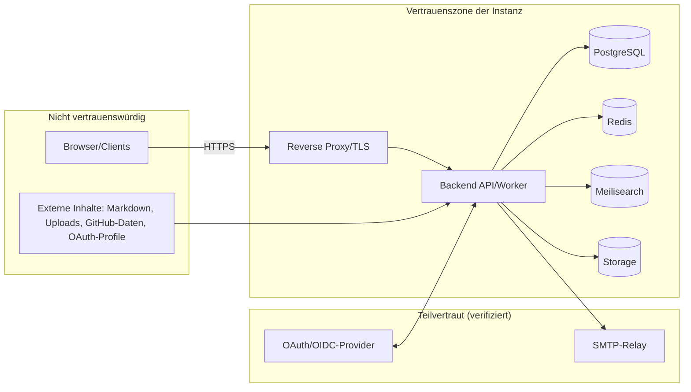

# Sicherheitsarchitektur & Threat Model

**Status:** Verbindlich · **Version:** 1.0 · **Stand:** 2026-07-20

## 1. Prinzipien

| Prinzip | Umsetzung |
|---|---|
| Defense in Depth | Guard-Pipeline + Service-Prüfungen + DB-Constraints + Audit |
| Least Privilege | feingranulare Permissions, Scopes, PAT-Scopes, minimale DB-Grants |
| Secure by Default | Setup erzwingt sichere Defaults; unsichere Optionen erfordern bewusste Aktion |
| Fail Closed | Fehler in AuthZ/Validierung ⇒ Ablehnung, nie Durchlass |
| Privacy by Design | Datenminimierung, Pseudonymisierung, Retention (→ [database/06](../database/06-data-lifecycle-gdpr.md)) |
| Nachvollziehbarkeit | Audit-Pflichtkatalog ([07](07-audit-logging.md)), Request-IDs |

## 2. Trust Boundaries

**Grenzregeln:** Alles, was die Grenze von „Untrusted" nach innen überquert, wird validiert
(Zod), autorisiert (`can()`), sanitisiert (Markdown/Uploads) und limitiert (Rate Limits).
Interne Dienste (PG/Redis/MS) sind **nie** öffentlich exponiert
(→ [deployment/01](../deployment/01-environments-topologies.md)); Meilisearch-Master-Key und
DB-Credentials verlassen die Trusted-Zone nicht.

## 3. Schutzgüter (Assets)

1. Benutzerkonten & Credentials (Hashes, MFA-Secrets, Sessions, PATs)
2. Nicht-öffentliche Inhalte (private/Org-Spaces — Geschäftsgeheimnisse in Enterprise-Setups)
3. Instanz-Secrets (OAuth-Client-Secrets, SMTP, GitHub-Token, Encryption Keys)
4. Integrität öffentlichen Wissens (Verfälschung geprüfter Artikel = Reputationsschaden)
5. Audit-Log (Beweiskraft)
6. Verfügbarkeit der Instanz

## 4. STRIDE-Threat-Model (Top-Bedrohungen & Gegenmaßnahmen)

| # | Bedrohung (STRIDE) | Szenario | Gegenmaßnahmen |
|---|---|---|---|
| T1 | Spoofing | Credential Stuffing / Brute Force auf Login | Argon2id, Rate Limits (IP+Konto), Enumeration-Schutz I-8, MFA, Security-Mails ([02](02-authentication-security.md)) |
| T2 | Spoofing | OAuth-Flow-Manipulation (CSRF/Code-Injection, Mix-up) | state+PKCE+nonce (I-12), Redirect-URI-Exaktprüfung, Provider-Config nur Admin |
| T3 | Tampering | Stored XSS über Markdown/Kommentare/Bio | eine Sanitizing-Pipeline (Allowlist, ADR-0012), CSP, Fuzz-Tests ([05](05-application-security.md)) |
| T4 | Tampering | Schadhafte Uploads (Polyglot, Bombe) | Magic Bytes, Pixel-Limits, Re-Encode-Pflicht, Quarantäne (media-Pipeline) |
| T5 | Repudiation | Admin bestreitet Rechteänderung | Pflicht-Audit mit Vorher/Nachher (A-9), append-only (AU-1) |
| T6 | Information Disclosure | IDOR / Leak privater Inhalte über API, Suche, Facetten | 404-Semantik, `can()` an jedem Objektzugriff, Filter-in-Query (S-1), Leak-Tests ([03](03-authorization-enforcement.md)) |
| T7 | Information Disclosure | Secret-Leak (Logs, Fehler, Repo) | Feldverschlüsselung, Log-/Audit-Redaction (AU-4), Secret Scanning ([06](06-secure-development-pipeline.md)), Problem-Details ohne Interna |
| T8 | Denial of Service | Teure Endpunkte (Suche, Upload, Render, Export) fluten | Rate-Limit-Staffeln, Payload-Limits, Job-Auslagerung, Timeouts |
| T9 | Elevation of Privilege | Selbst-Eskalation über Rollen-/Gruppenverwaltung | Eskalations-Sperre A-10, geschützte Systemrollen A-3, Vier-Augen bei kritischen Aktionen |
| T10 | Elevation of Privilege | SSRF über nutzergesteuerte URLs (Webhooks) | URL-Allowlist-Validierung (N-7); Repo-Sync kennt nur GitHub-Basis-URL |
| T11 | Tampering | Supply-Chain (kompromittierte Dependency) | SCA, Lockfile-Pflicht, Renovate-Review, Container-Scanning ([06](06-secure-development-pipeline.md)) |
| T12 | Spoofing | Session-Diebstahl/Fixierung | HTTP-only `__Host-`-Cookie, Token-Rotation bei Login/Privilegienwechsel (I-14), Revoke-Fähigkeit |

Das Threat Model wird je Release-Phase überprüft (Meilenstein-Checkliste) und bei neuen
Features (insbesondere neuen externen Schnittstellen) ergänzt.

## 5. Sicherheitsrelevante Pflichtprüfungen pro Feature

Jedes Feature, das **Inhalte, Rechte, Geld-äquivalente Werte (Reputation) oder Konten**
berührt, beantwortet im PR die Checkliste
[checklists/code-review-security.md](checklists/code-review-security.md). Ohne beantwortete
Checkliste kein Merge (→ [development-guidelines/06](../development-guidelines/06-definition-of-done.md)).
