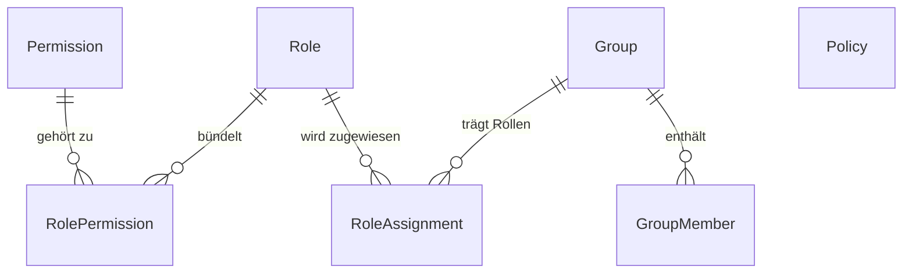

# Authorization Service

**Status:** Verbindlich · **Version:** 1.0 · **Stand:** 2026-07-20 ·
**FRs:** FR-AUTZ-001…010 · **ADR:** [ADR-0008](../architecture/decisions/adr-0008-hybrid-rbac-abac.md) ·
**Schema:** [database/schemas/authorization.md](../database/schemas/authorization.md)

## 1. Zweck & Verantwortlichkeiten

Zentrale Zugriffsentscheidung der Plattform (hybrides **RBAC + ABAC**):

- Permission-Katalog (Definition im Code, Synchronisation in die DB)
- Rollen (System- und Custom-Rollen) mit Scope-Typen
- Gruppen als Rechteträger
- Rollenzuweisungen an Nutzer/Gruppen mit Scope-Instanz
- ABAC-Policies (Bedingungen, Effekt, Priorität)
- `AccessDecisionService` — der einzige Entscheidungspunkt
- Entscheidungs-Caching + Invalidierung
- Berechtigungsauskunft (effektive Rechte inkl. Herkunft)

## 2. Abgrenzung

| Nicht hier | Sondern |
|---|---|
| Authentifizierung, Sessions, MFA-Zustand | `identity` (liefert Attribute an ABAC) |
| Sichtbarkeitsregeln von Inhalten (public/org/…) | Fachmodule entscheiden *mit* `AccessDecisionService`, Sichtbarkeit ist Ressourcen-Attribut |
| Org-Mitgliedschafts-Verwaltung | `organization` (liefert Attribute) |

## 3. Domänenmodell

- `Permission` — `key` (`<modul>.<ressource>.<aktion>`), Beschreibung, Modul. Quelle der
  Wahrheit ist der **Code** (`permission-catalog.ts` in `packages/shared-types`); ein
  Startup-Sync legt fehlende Keys an und markiert verwaiste.
- `Role` — `key`, Name, Beschreibung, `scopeType` (`global`|`organization`|`space`|`language`),
  `isSystem`.
- `RoleAssignment` — `principalType` (`user`|`group`), `principalId`, `roleId`, `scopeType`,
  `scopeId?` (null bei `global`).
- `Group` — instanzweit oder org-gebunden (`orgId?`); `GroupMember`.
- `Policy` — Name, Beschreibung, `effect` (`allow`|`deny`), `actions` (Permission-Keys, Wildcard
  `knowledge.article.*` erlaubt), `subjectCondition`/`resourceCondition`/`contextCondition`
  (JSON-Bedingungssprache, Version `v1`), `priority` (int), `enabled`.

## 4. Fachliche Regeln

### Permission-Konvention

- **A-1:** Schema `<modul>.<ressource>.<aktion>`, alles lowercase, Aktionen aus dem Verbkatalog:
  `read`, `create`, `update`, `delete`, `submit`, `review`, `publish`, `archive`, `manage`
  (= Vollzugriff auf die Ressource inkl. Rechtevergabe im Scope), `moderate`, `assign`, `export`.
- **A-2:** Neue Permissions entstehen **nur** im Katalog in `shared-types` (ein PR = Katalog +
  Nutzung + Doku). Der Katalog ist nach Modulen gruppiert; jede Permission trägt eine
  deutschsprachige Beschreibung für die Admin-UI.

### Systemrollen (mitgeliefert, `isSystem = true`)

| Rolle | Scope | Kern-Permissions (Auszug) |
|---|---|---|
| `platform.admin` | global | `*.*.*` außer nicht-delegierbare Setup-Aktionen |
| `platform.moderator` | global | `knowledge.*.moderate`, `knowledge.comment.delete`, `profile.profile.moderate` |
| `platform.member` | global | Basis: `knowledge.article.create`, `knowledge.comment.create`, `media.object.create`, `translation.translation.create`, `repository.project.create` |
| `space.maintainer` | space | `knowledge.article.manage`, `knowledge.article.publish`, `knowledge.review.review`, `knowledge.category.manage`, `authorization.assignment.assign` (nur Space-Rollen) |
| `space.reviewer` | space | `knowledge.review.review`, `knowledge.article.read` (inkl. `in_review`) |
| `space.contributor` | space | `knowledge.article.create/update` (eigene), `knowledge.article.submit` |
| `org.owner` | organization | `organization.organization.manage`, inkl. Löschung + Rechtevergabe |
| `org.admin` | organization | Mitglieder/Teams/Spaces verwalten, ohne Org-Löschung/Owner-Wechsel |
| `org.member` | organization | Org-Inhalte lesen (`organization.space.read`) |
| `language.maintainer` | language | `translation.translation.manage`, `translation.review.review`, `authorization.assignment.assign` (nur `translation.reviewer`) |
| `translation.reviewer` | language | `translation.review.review` |

- **A-3:** Systemrollen sind nicht löschbar; ihre Kern-Permissions nicht entfernbar
  (zusätzliche sind erlaubt). `platform.admin` ist mindestens einem aktiven Konto zugewiesen —
  die letzte Zuweisung ist nicht entfernbar (Aussperr-Schutz; Ausweg: Recovery-System).
- **A-4:** Unangemeldete Besucher haben **keine** Rolle; öffentliche Lesbarkeit ist eine
  Eigenschaft der Ressource (`visibility = public`), die Fachmodule vor der
  Permission-Prüfung auswerten.

### Entscheidungslogik

- **A-5:** `can(actor, permissionKey, resourceRef?)` evaluiert in dieser Reihenfolge; das erste
  zutreffende Ergebnis gewinnt:
  1. `deny`-Policies (nach `priority` absteigend)
  2. `allow`-Policies
  3. RBAC: Zuweisungen des Nutzers und seiner Gruppen im passenden Scope
     (`global`-Zuweisungen decken alle Scopes)
  4. Default: **deny**
- **A-6:** ABAC-Attribute v1: Subjekt (`user.id`, `user.mfaVerified`, `user.emailVerified`,
  `user.groupIds`, `user.orgIds`, `user.accountAgeDays`, `user.reputation`), Ressource
  (`resource.type`, `resource.spaceId`, `resource.orgId`, `resource.visibility`,
  `resource.authorId`, `resource.status`), Kontext (`context.channel` (`web`|`pat`),
  `context.time`). Bedingungssprache: JSON mit Operatoren `eq`, `neq`, `in`, `nin`, `gte`,
  `lte`, `contains`, verknüpft mit `all`/`any`/`not`.
- **A-7:** Entscheidungen werden pro (`userId`, `scopeKey`) 60 s in Redis gecacht; Events
  `authorization.assignment.changed`, `organization.member.*`, Policy-Änderungen und
  Gruppenänderungen invalidieren gezielt.
- **A-8:** Owner-Kurzschluss: Fachmodule dürfen „Autor darf eigenen Draft bearbeiten" als
  explizite Regel im Service prüfen — dokumentiert und zusätzlich zu, nie statt, `can()`.

### Verwaltung

- **A-9:** Rechteänderungen (Rolle erstellen/ändern, Zuweisung, Policy) erfordern
  `authorization.role.manage` bzw. `authorization.assignment.assign` im betroffenen Scope und
  erzeugen **immer** Audit-Events mit Vorher/Nachher.
- **A-10:** Niemand kann sich selbst Rechte erhöhen: Zuweisungen der eigenen Person auf Rollen
  mit mehr Permissions als die eigenen effektiven werden abgelehnt (Privilege-Escalation-Sperre).

## 5. Schnittstellen

### API (Auszug)

`/admin/roles`, `/admin/roles/:id/permissions`, `/admin/groups`, `/admin/assignments`,
`/admin/policies`, `/admin/users/:id/effective-permissions` (FR-AUTZ-010),
`/auth/session` liefert dem Frontend die effektiven Permission-Keys für UI-Zwecke.

### Domain Events

Publiziert: `authorization.assignment.changed`, `authorization.role.changed`,
`authorization.policy.changed`, `authorization.group.changed` — Konsumenten: audit, Cache,
search (Sichtbarkeitsupdate).

### Ports

- `AccessDecisionPort.can(actor, permission, resource?)` / `canBulk(...)`
- `AccessDecisionPort.getAccessibleScopeIds(actor, permission, scopeType)` — für Suche/Listen
  („alle Space-IDs, in denen X lesen darf")
- `AuthorizationAdminPort.assignSystemRole(...)` — für Setup Wizard und Organization-Modul
  (Owner-Rolle bei Org-Gründung)

## 6. Hintergrundjobs

Keine eigenen; Cache-Invalidierung ist event-getrieben synchron.

## 7. Konfiguration

`Config.rbacEnabled` existiert **nicht** — Autorisierung ist nie abschaltbar. Für lokale
Entwicklung gibt es Seed-Daten mit vorkonfigurierten Test-Konten
(→ [development-guidelines/01](../development-guidelines/01-repository-structure.md)).

## 8. Sicherheit

Dieses Modul ist sicherheitskritisch: 100 %-Testabdeckungsziel der Entscheidungslogik
(NFR-042), Property-Tests für Policy-Evaluation, Startup-Check „jeder Endpunkt deklariert
Permission oder `@Public()`" (FR-AUTZ-008). Details:
[security/03](../security/03-authorization-enforcement.md).

## 9. Offene Punkte

- Zeitgebundene Zuweisungen (Ablaufdatum) — Schema sieht `expiresAt?` vor, UI in Phase 3.
- Policy-Simulation („was wäre wenn") als Admin-Werkzeug — nach 1.0.
