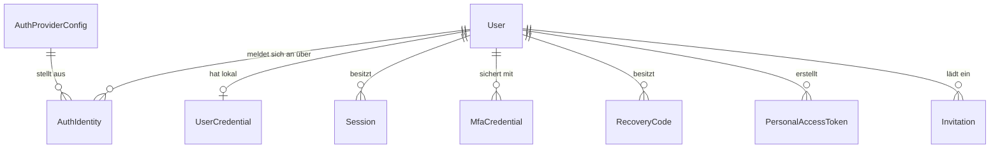

# Identity Service

**Status:** Verbindlich · **Version:** 1.0 · **Stand:** 2026-07-20 ·
**FRs:** FR-IDNT-001…020 · **Schema:** [database/schemas/identity.md](../database/schemas/identity.md)

## 1. Zweck & Verantwortlichkeiten

Das Identity-Modul besitzt alle Daten und Abläufe rund um **Benutzerkonten und Anmeldung**:

- Benutzerkonten (Handle, E-Mail, Status, Locale)
- Lokale Credentials (Passwort-Hash) und E-Mail-Verifizierung
- **Identity-Provider-Abstraktion**: Discord, GitHub, Google OAuth; Microsoft Entra ID,
  Authentik, Keycloak und beliebige OAuth2-/OIDC-Provider über einen generischen OIDC-Adapter
- Account-Linking (mehrere Identitäten pro Konto)
- Sessions (serverseitig, → [ADR-0011](../architecture/decisions/adr-0011-session-auth-server-side.md))
- MFA: TOTP, Recovery Codes; WebAuthn/FIDO2/Passkeys vorbereitet
- MFA-Policies (optional / rollenbasiert / gruppenbasiert / verpflichtend)
- Personal Access Tokens (PAT)
- Registrierungsmodi und Einladungen auf Instanzebene
- Konto-Lifecycle: aktiv, gesperrt, deaktiviert, gelöscht (DSGVO)

## 2. Abgrenzung

| Nicht hier | Sondern |
|---|---|
| Rollen, Permissions, Policies | `authorization` |
| Profilinhalte (Bio, Skills, Reputation) | `profile` |
| Organisationsmitgliedschaften | `organization` |
| E-Mail-Versand (Rendering/SMTP) | `notification` (Identity liefert nur Ereignisse/Empfänger) |

## 3. Domänenmodell

Kernentitäten (Details → Schema-Doku): `User`, `UserCredential`, `AuthProviderConfig`
(instanzweit konfigurierte Provider), `AuthIdentity` (Verknüpfung User ↔ Provider-Konto),
`Session`, `MfaCredential` (typ: `totp` | `webauthn`), `RecoveryCode`, `PersonalAccessToken`,
`Invitation`, `EmailToken` (Verifizierung/Reset, zweckgebunden).

## 4. Fachliche Regeln

### Konten

- **I-1:** E-Mail-Adressen sind instanzweit eindeutig (case-insensitiv, normalisiert).
  Handles sind eindeutig, 3–39 Zeichen, `[a-z0-9-]`, keine führenden/folgenden Bindestriche.
- **I-2:** Handle-Änderung erzeugt einen Redirect-Eintrag (alte URL bleibt 90 Tage gültig,
  FR-IDNT-020); ein freigewordener Handle ist 90 Tage gesperrt (Impersonation-Schutz).
- **I-3:** Kontostatus: `active` | `suspended` (durch Admin, reversibel) | `deactivated`
  (durch Nutzer, reversibel) | `deleted` (endgültig, anonymisiert). Nur `active` darf sich
  anmelden.
- **I-4:** Statuswechsel zu `suspended`/`deleted` widerruft **sofort** alle Sessions und PATs.

### Registrierung & lokale Anmeldung

- **I-5:** Registrierungsmodi (FR-IDNT-017): `open` | `invite_only` | `closed`. Bei
  `invite_only` ist ein gültiges Einladungstoken Pflicht; bei `closed` entstehen Konten nur per
  SSO-JIT-Provisionierung oder Admin-Anlage.
- **I-6:** Passwort-Policy: min. 12 Zeichen, Prüfung gegen Kompromittierungslisten
  (lokale Top-Liste, optional HIBP-k-Anonymity per Konfiguration), keine
  Komplexitäts-Theaterregeln. Hashing: Argon2id
  (Parameter → [security/02](../security/02-authentication-security.md)).
- **I-7:** Unverifizierte Konten dürfen sich anmelden, aber nicht beitragen (Permission-Gate
  `verified` als ABAC-Attribut); Verifizierungs-Token 24 h gültig, einmalig.
- **I-8:** Alle Auth-Antworten sind enumeration-sicher: identische Antworten/Zeiten für
  existierende und nicht existierende Konten (US-02-01).

### Provider & Account-Linking

- **I-9:** `AuthProviderConfig` beschreibt einen Provider: `type` (`discord` | `github` |
  `google` | `oidc`), Anzeigename, Client-ID, Client-Secret (verschlüsselt), Issuer/Endpoints
  (bei `oidc` via Discovery), Scopes, Flags (`enabled`, `allowRegistration`,
  `jitProvisioning`, `trustEmailVerified`).
- **I-10:** Matching beim Provider-Login: primär über (`providerId`, `providerUserId`).
  Auto-Linking über E-Mail nur, wenn der Provider die E-Mail als verifiziert meldet **und**
  `trustEmailVerified` aktiv ist; sonst explizite Bestätigung durch angemeldeten Nutzer.
- **I-11:** Die letzte Anmeldemethode eines Kontos ist nicht entfernbar (kein aussperrendes
  Unlink); Unlink erfordert Re-Auth (frische Session ≤ 5 min oder Passwort/MFA).
- **I-12:** OAuth-Flows: Authorization Code + PKCE + `state` (einmalig, Redis, 10 min TTL);
  bei OIDC zusätzlich `nonce`-Prüfung des ID-Tokens. Provider-Refresh-Tokens werden nur
  gespeichert, wenn ein Feature sie braucht — verschlüsselt (NFR-022).

### Sessions

- **I-13:** Session-Token: 256 bit Zufall, im Cookie `__Host-session`; serverseitig nur als
  SHA-256-Hash gespeichert. Idle-Timeout 14 Tage (rolling), absolute Lebensdauer 90 Tage —
  beides instanzkonfigurierbar.
- **I-14:** Session-Fixation-Schutz: neues Token bei Login und bei Privilegienwechsel
  (MFA-Bestätigung, Rollenübernahme).
- **I-15:** Jede Session speichert `mfaVerified`. MFA-pflichtige Aktionen und Policies prüfen
  dieses Flag; sensible Operationen (Passwortänderung, Unlink, PAT-Erstellung, Löschung)
  verlangen **frische** Re-Auth (≤ 5 min).

### MFA

- **I-16:** TOTP: RFC 6238, 30-s-Fenster, ±1 Drift; Secret verschlüsselt; Aktivierung erst nach
  erfolgreicher Code-Verifizierung. Replay-Schutz: zuletzt akzeptierter Zeitschritt wird
  gespeichert und nicht erneut akzeptiert.
- **I-17:** Bei MFA-Aktivierung werden 10 Recovery Codes erzeugt (einmalig sichtbar, gehasht
  gespeichert); Nutzung entwertet den Code, versendet einen Security-Hinweis und zählt gegen
  ein Audit-Event (US-02-04). Regenerierung entwertet alle alten Codes.
- **I-18:** MFA-Policies (FR-IDNT-013) werden bei jeder Anmeldung **und** Session-Nutzung
  evaluiert: Ein von einer Policy erfasster Nutzer ohne MFA landet in einem Enrollment-Zwang
  (nur MFA-Setup-Endpunkte erreichbar).
- **I-19:** WebAuthn (FR-IDNT-014): `MfaCredential.type = webauthn` mit Public-Key-Daten ist im
  Schema vorgesehen; Endpunkte werden in Phase 3 ergänzt — keine Schemaänderung nötig.

### PATs & Einladungen

- **I-20:** PATs: Prefix `lirp_`, nur Hash gespeichert, Scopes als Permission-Subset des
  Erstellers, Ablauf max. 1 Jahr, letzte Nutzung wird protokolliert. Widerruf sofort wirksam.
- **I-21:** Einladungen: zweckgebundene Tokens (E-Mail-gebunden oder offen), Ablauf
  konfigurierbar (Default 14 Tage), optional mit vordefinierten Rollen-/Gruppenzuweisungen.

## 5. Schnittstellen

### API (Auszug — vollständig in [api/endpoints/identity.md](../api/endpoints/identity.md))

`/auth/*` (Login, Logout, OAuth-Start/Callback, Session-Info, MFA-Challenge),
`/auth/mfa/*` (TOTP-Setup, Recovery Codes), `/users/me/*` (Konto, Identitäten, Sessions, PATs),
`/admin/users/*`, `/admin/auth-providers/*`, `/invitations/*`.

### Domain Events (publiziert)

| Event | Payload (Kern) | Konsumenten |
|---|---|---|
| `identity.user.registered` | `userId`, `via` (`local`/`providerId`), `invitedBy?` | profile, notification, audit |
| `identity.user.suspended` / `reactivated` | `userId`, `actorId`, `reason` | audit, notification |
| `identity.user.deleted` | `userId` (bereits anonymisiert) | alle Module, search |
| `identity.login.succeeded` / `failed` | `userId?`, `method`, `ip` | audit (failed: Rate-Limit-Zähler) |
| `identity.session.revoked` | `userId`, `sessionId`, `revokedBy` | audit |
| `identity.mfa.enabled` / `disabled` / `recovery_code_used` | `userId`, `type` | audit, notification |
| `identity.provider.changed` | `providerId`, `actorId` | audit, configuration (Cache) |

### Ports (für andere Module)

- `IdentityPort.getUserRef(userId)` — Anzeige-Referenz (id, handle, displayName, avatarMediaId,
  status) für Attribution in Fachmodulen
- `IdentityPort.getNotificationTarget(userId)` — E-Mail + Locale für Notification
- `IdentityPort.requireActiveUser(userId)` — Existenz-/Statusprüfung

## 6. Hintergrundjobs

| Job | Queue | Zweck |
|---|---|---|
| `session-gc` | maintenance | abgelaufene Sessions/Tokens/Einladungen bereinigen (Cron, stündlich) |
| `anonymize-user-content` | maintenance | DSGVO-Löschkaskade (→ [database/06](../database/06-data-lifecycle-gdpr.md)) |

## 7. Konfiguration

Instanz (DB, Admin-UI): Registrierungsmodus, Session-Lebensdauern, Passwort-Policy-Schärfe,
MFA-Policies, Provider-Konfigurationen. ENV (Bootstrap): `SESSION_COOKIE_DOMAIN?`,
Verschlüsselungsschlüssel (→ [deployment/04](../deployment/04-configuration-reference.md)).

## 8. Sicherheit

Rate Limits auf allen Auth-Endpunkten (Staffel → [security/02](../security/02-authentication-security.md)),
Enumeration-Schutz (I-8), Audit-Pflicht für alle Ereignisse aus §5, Secrets verschlüsselt
(NFR-022). Das Modul ist Gegenstand des Threat Models
[security/01](../security/01-security-architecture-threat-model.md) (Spoofing/Elevation).

## 9. Offene Punkte

- Anbindungsreihenfolge weiterer Provider nach 1.0 (GitLab? Apple?) — Bedarf beobachten.
- HIBP-Anbindung default-on oder default-off? (Datenschutzabwägung; Entscheid vor Phase 1-Ende.)
- SCIM-Provisionierung für Enterprise nach 1.0 evaluieren.
