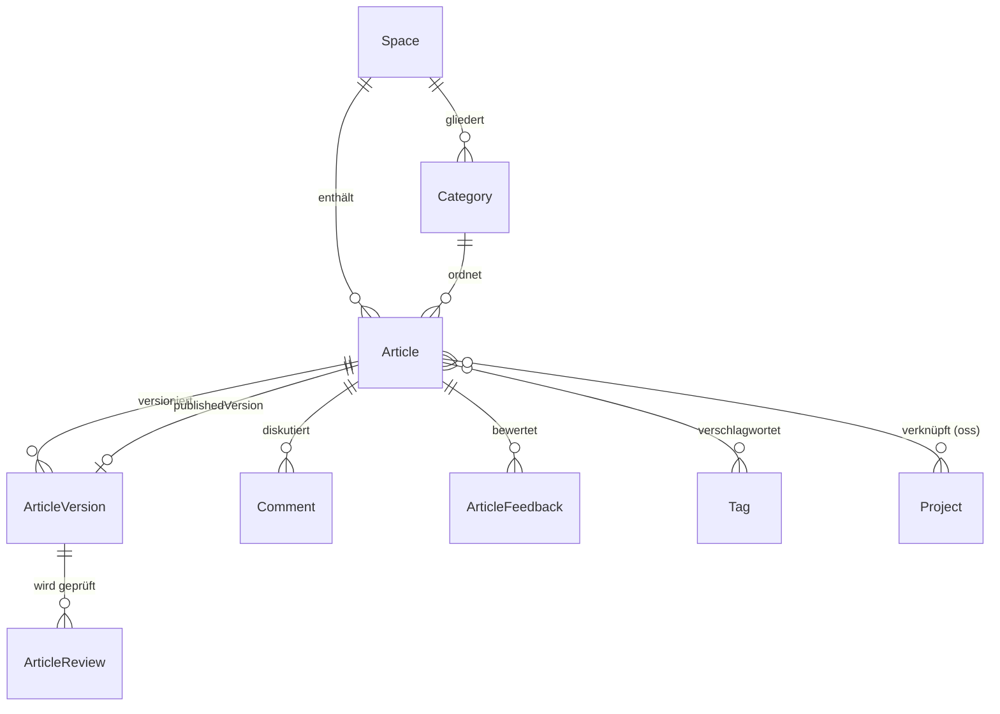

# Knowledge Service

**Status:** Verbindlich · **Version:** 1.0 · **Stand:** 2026-07-20 ·
**FRs:** FR-KNOW-001…017 · **ADR:** [ADR-0012](../architecture/decisions/adr-0012-markdown-content-format.md) ·
**Schema:** [database/schemas/knowledge.md](../database/schemas/knowledge.md)

## 1. Zweck & Verantwortlichkeiten

Das inhaltliche Kernmodul — besitzt:

- **Spaces** (Wissensbereiche) mit Sichtbarkeit und Space-Einstellungen
- **Kategorien** (hierarchisch, max. 3 Ebenen) und **Tags**
- **Artikel** mit Typen: Learning Basics, Best Practices, How-To Guides, Troubleshooting,
  Open-Source-Wissen
- **Versionierung**: unveränderliche Versionen mit Autor + Änderungsnotiz
- **Lifecycle & Review-Workflow** inkl. Änderungsvorschläge Dritter
- **Markdown-Render-Pipeline** (zentral, sanitisiert)
- **Kommentare** (Threads, resolve) und **Hilfreich-Feedback**
- Slugs + Redirects

## 2. Abgrenzung

| Nicht hier | Sondern |
|---|---|
| Übersetzungen | `translation` (baut auf Artikel/Versionen auf) |
| Bild-Dateien | `media` (Artikel referenziert Media-IDs) |
| Suchindex | `search` (konsumiert Events, liest über Port) |
| Reputationspunkte | `profile` (konsumiert Events) |
| Org-Verwaltung | `organization` (Space trägt nur `orgId`) |

## 3. Domänenmodell

Kernfelder: `Article` (`spaceId`, `categoryId?`, `type`, `slug`, `originalLocale`, `status`,
`publishedVersionId?`, `createdById`, Zähler denormalisiert: `helpfulCount`, `commentCount`);
`ArticleVersion` (`version` fortlaufend, `title`, `summary`, `contentMarkdown`,
`contentHtmlCached`, `changeNote`, `authorId`, `basedOnVersionId?`, `reviewStatus`).

## 4. Fachliche Regeln

### Spaces & Struktur

- **K-1:** Space-Sichtbarkeiten (FR-KNOW-006): `public` (jeder, auch anonym) · `internal`
  (alle angemeldeten) · `organization` (Org-Mitglieder) · `private` (nur explizit Berechtigte).
  Nicht-berechtigte Zugriffe liefern **404** (keine Existenz-Preisgabe).
- **K-2:** Space-Einstellungen: `reviewRequired` (Default aus Instanz-Policy, FR-CONF-005),
  `defaultLocale`, erlaubte Artikeltypen, `commentsEnabled`.
- **K-3:** Kategorien: max. Tiefe 3, `order` innerhalb der Ebene; Löschen nur leer oder mit
  Ziel-Kategorie für Verschiebung.
- **K-4:** Slugs (FR-KNOW-017): pro Space eindeutig, aus Titel generiert, änderbar; Änderung
  legt `SlugRedirect` an (unbegrenzt gültig, bereinigt bei Konflikt).

### Versionierung

- **K-5:** Versionen sind **unveränderlich**. Jede inhaltliche Änderung (Titel, Summary,
  Markdown, Kategorie-relevante Metadaten) erzeugt Version `n+1` mit `changeNote` (Pflicht ab
  Version 2) und `basedOnVersionId`.
- **K-6:** `publishedVersionId` zeigt auf genau die live sichtbare Version. Neuere Versionen in
  Review beeinflussen die publizierte Fassung nicht (US-04-03).
- **K-7:** Konfliktregel: basiert eine eingereichte Version nicht auf der aktuellen
  `publishedVersionId`, wird der Einreicher gewarnt und der Diff gegen die aktuelle Fassung
  angezeigt; Merge ist manuell (kein Auto-Merge in 1.0).

### Lifecycle & Review

```mermaid
stateDiagram-v2
    [*] --> draft
    draft --> in_review : submit (Autor)
    in_review --> draft : changes_requested / withdraw
    in_review --> published : publish (nach approve; Berechtigter)
    published --> published : neue Version publiziert
    published --> archived : archive
    archived --> published : unarchive
    draft --> [*] : delete (nur nie publizierte)
```

- **K-8:** `submit` erfordert `knowledge.article.submit` + Autorschaft (oder `manage`);
  Ereignis `knowledge.article.submitted` benachrichtigt Space-Reviewer.
- **K-9:** Review (FR-KNOW-005): Reviewer mit `knowledge.review.review` im Space geben
  `approved` oder `changes_requested` (Kommentar Pflicht bei `changes_requested`) je Version ab.
  Autoren können eigene Versionen nicht selbst reviewen — Ausnahme: Space mit
  `reviewRequired = false`, dort ist `publish` direkt erlaubt.
- **K-10:** `publish` erfordert `knowledge.article.publish` und (bei `reviewRequired`)
  mindestens ein `approved` der aktuellen Version. Publikation setzt `publishedVersionId`,
  publiziert Event → Suche/Übersetzungs-Outdated/Reputation/Watcher (US-04-02).
- **K-11:** Änderungsvorschläge Dritter (FR-KNOW-012): jeder mit `article.read` +
  `article.create` im Space darf auf Basis der publizierten Version eine Vorschlagsversion
  einreichen (`in_review`, Autor = Vorschlagender). Annahme durch Maintainer publiziert sie;
  ursprünglicher Autor bleibt in der Versionshistorie attributiert (CC BY-SA).
- **K-12:** Archivierung (FR-KNOW-014): Banner in der UI, Ausschluss aus Standard-Suche
  (Flag im Index), Redirects bleiben.
- **K-13:** Harte Löschung nur für nie publizierte Artikel; publizierte werden archiviert
  (Nachvollziehbarkeit, Lizenz). Moderative Depublikation (`platform.moderator`) setzt Status
  `archived` + `moderationNote` + Audit.

### Inhalt & Rendering

- **K-14:** Markdown-Pipeline gemäß ADR-0012; gerendertes HTML wird pro Version gecacht
  (`contentHtmlCached`), Cache-Rebuild bei Pipeline-Upgrade über `maintenance`-Job.
- **K-15:** Bild-Referenzen im Markdown nutzen `media:<mediaId>`-URIs; die Pipeline löst sie zu
  `srcset` der Varianten auf. Externe Bild-URLs werden **nicht** eingebettet (Privacy/Mixed
  Content) — nur als Link gerendert.
- **K-16:** Interne Links (`[[space/slug]]` oder relative URLs) werden beim Rendern validiert;
  tote interne Links erzeugen Warnungen im Editor (nicht blockierend).
- **K-17:** Limits: Markdown ≤ 512 KB/Version, Titel ≤ 160 Zeichen, Summary ≤ 400 Zeichen,
  ≤ 10 Tags/Artikel.

### Kommentare & Feedback

- **K-18:** Kommentare (FR-KNOW-010): 1 Thread-Ebene (Kommentar + Antworten), Markdown-Subset
  (kein Bild-Upload), editierbar 15 min durch Autor (mit `edited`-Flag), löschbar durch Autor
  (Tombstone bei vorhandenen Antworten) und Moderation. `resolved` durch Maintainer/Autor des
  Artikels.
- **K-19:** Hilfreich-Feedback (FR-KNOW-011): genau 1 Stimme pro Nutzer+Artikel, togglebar;
  Zähler denormalisiert am Artikel; Event für Reputation.

## 5. Schnittstellen

**API (Auszug):** `/spaces`, `/spaces/:slug/categories`, `/articles` (CRUD + `submit`,
`publish`, `archive`), `/articles/:id/versions`, `/articles/:id/versions/:a/diff/:b`,
`/articles/:id/reviews`, `/articles/:id/comments`, `/articles/:id/feedback`, `/tags`.

**Publizierte Events:** `knowledge.article.submitted` / `published` / `archived` / `deleted`,
`knowledge.review.completed`, `knowledge.comment.created` / `resolved` / `deleted`,
`knowledge.feedback.given`, `knowledge.space.visibility_changed` (→ Suche: Space-Reindex).

**Ports:** `KnowledgeReadPort.getArticleForIndex(articleId)` (Suche),
`KnowledgeReadPort.getPublishedVersion(articleId)` (Translation),
`KnowledgeAdminPort.countByUser(userId)` (Profil-Statistik).

## 6. Hintergrundjobs

| Job | Queue | Zweck |
|---|---|---|
| `rebuild-html-cache` | maintenance | Re-Rendering nach Pipeline-Änderung |
| `article-link-check` | maintenance | interne Links prüfen, Warnliste je Space (wöchentlich) |

## 7. Konfiguration

Instanz: Review-Pflicht-Default, Kommentare global an/aus, erlaubte Artikeltypen-Defaults.
Space-Ebene: siehe K-2.

## 8. Sicherheit

Nutzer-Markdown ist der größte XSS-Vektor → Sanitizing-Allowlist zentral, Fuzz-Tests der
Pipeline (→ [security/05](../security/05-application-security.md)). Sichtbarkeit: jede Query
filtert nach `getAccessibleScopeIds` (kein nachgelagertes Ausblenden). IDOR-Prävention: alle
Objektzugriffe prüfen Space-Kontext.

## 9. Offene Punkte

- Auto-Merge-Unterstützung für Änderungsvorschläge (3-Wege-Merge) — nach 1.0.
- Serien/Lernpfade (FR-KNOW-016, Could) — Datenmodell-Skizze existiert, Umsetzung Phase 3+.
- Export einzelner Spaces (Markdown-Bundle) für Portabilität — nach 1.0.
