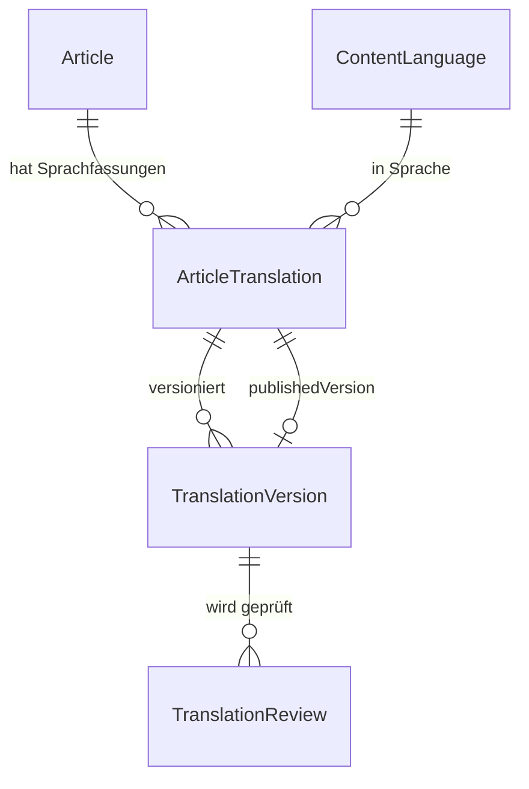

# Translation Service

**Status:** Verbindlich · **Version:** 1.0 · **Stand:** 2026-07-20 ·
**FRs:** FR-TRAN-001…009 · **Schema:** [database/schemas/translation.md](../database/schemas/translation.md)

## 1. Zweck & Verantwortlichkeiten

Community-getriebene Übersetzungen als zentraler Plattform-Bestandteil (Fachkonzept §9):

- Übersetzungen pro Artikel und Zielsprache mit eigenem Lifecycle und eigener Versionierung
- Workflow: Vorschlag → Review → Freigabe → Veröffentlichung
- **Versionssynchronisation** mit dem Original (Outdated-Erkennung)
- Rollenmodell: Translator, Translation Reviewer, Language Maintainer
- Sprachverwaltung (aktivierte Content-Sprachen) und Fortschritts-Dashboards
- **Keine zwingende KI-Abhängigkeit** — optionale MT-Schnittstelle ist ein Adapter

## 2. Abgrenzung

| Nicht hier | Sondern |
|---|---|
| UI-Übersetzung der Plattform selbst | Frontend-i18n (NFR-033) — völlig getrenntes System |
| Original-Artikel und deren Reviews | `knowledge` |
| Rollen-Zuweisungsmechanik | `authorization` (Scope `language`) |

## 3. Domänenmodell

- `ContentLanguage` — BCP-47-`locale`, Anzeigename, `enabled`.
- `ArticleTranslation` — (`articleId`, `locale`) unique; `status`
  (`draft`|`in_review`|`published`|`outdated`|`archived`), `publishedVersionId?`.
- `TranslationVersion` — `version`, `title`, `summary`, `contentMarkdown`,
  `contentHtmlCached`, `translatorId`, **`sourceVersionId`** (die übersetzte Originalversion),
  `changeNote`.
- `TranslationReview` — analog `ArticleReview`.

## 4. Fachliche Regeln

- **T-1:** Übersetzungen existieren nur zu **publizierten** Artikeln und nie in der
  Originalsprache (`locale ≠ article.originalLocale`) und nur in aktivierten Sprachen
  (FR-TRAN-007).
- **T-2:** Jede `TranslationVersion` referenziert die Originalversion, auf der sie basiert
  (`sourceVersionId`) — Grundlage der Outdated-Logik und des Update-Diffs (US-05-02).
- **T-3:** Lifecycle wie Artikel; zusätzlich: publiziert das Original eine neue Version, wechseln
  alle publizierten Übersetzungen mit älterer `sourceVersionId` automatisch auf **`outdated`**
  (Event-Handler auf `knowledge.article.published`). Übersetzungen in Arbeit erhalten einen
  Hinweis, bleiben aber im Status.
- **T-4:** `outdated` bleibt **lesbar**: Leser sehen die Übersetzung mit Banner
  („basiert auf Version X, Original ist bei Y") und Link zum Original (FR-TRAN-008).
  Aktualisierung: neue TranslationVersion mit aktueller `sourceVersionId` → Review → Publikation
  → Status zurück auf `published`.
- **T-5:** Review-Regeln analog K-9: Reviewer brauchen `translation.review.review` im Scope der
  Sprache; Selbst-Review ausgeschlossen; Language Maintainer dürfen zusätzlich publizieren
  (`translation.translation.manage`).
- **T-6:** Wird das Original archiviert, werden alle Übersetzungen mit-archiviert (und bei
  Reaktivierung wiederhergestellt, dann ggf. `outdated`).
- **T-7:** Leser-Auflösung (FR-TRAN-008): angefragte Sprache → publizierte (auch outdated)
  Übersetzung, sonst Fallback Original; `hreflang`-Links listen alle publizierten Fassungen.
- **T-8:** Übersetzt werden `title`, `summary`, `contentMarkdown`. Struktur-Metadaten (Typ,
  Tags, Kategorie) bleiben vom Original. Media-Referenzen bleiben identisch; sprachspezifische
  Bilder sind über normale Media-Einbettung in der Übersetzung möglich.
- **T-9:** Fortschritts-Dashboard (FR-TRAN-005) je Sprache: publizierte Artikel gesamt, davon
  übersetzt, davon outdated, offene Reviews — berechnet aus Zählern, kein Live-Scan.
- **T-10:** Optionale MT-Integration (FR-TRAN-009): `MachineTranslationProvider`-Interface
  (`translate(markdown, from, to)`); liefert nur einen **Entwurfs-Vorbefüllung** im Editor,
  niemals automatische Publikation. Default: kein Provider konfiguriert.

## 5. Schnittstellen

**API (Auszug):** `/articles/:id/translations` (Liste + anlegen),
`/translations/:id` (CRUD), `/translations/:id/submit|publish`, `/translations/:id/reviews`,
`/translations/:id/source-diff` (Diff zwischen übersetzter und aktueller Originalversion),
`/languages` (+ Admin-Verwaltung), `/languages/:locale/dashboard`.

**Publizierte Events:** `translation.translation.submitted` / `published` / `outdated` /
`archived`, `translation.review.completed`.

**Konsumierte Events:** `knowledge.article.published` (T-3), `knowledge.article.archived` (T-6).

**Ports:** `TranslationReadPort.getPublishedTranslation(articleId, locale)` (Knowledge-Ausspielung/SSR),
`TranslationReadPort.getTranslationForIndex(id)` (Suche).

## 6. Hintergrundjobs

| Job | Queue | Zweck |
|---|---|---|
| `mark-outdated-translations` | maintenance | Kaskade nach Original-Publikation (aus Event enqueued, idempotent) |
| `language-stats-refresh` | maintenance | Dashboard-Zähler konsolidieren (stündlich) |

## 7. Konfiguration

Modul-Flag `translation` (FR-CONF-004); aktivierte Sprachen; MT-Provider (optional, Secrets
verschlüsselt).

## 8. Sicherheit

Gleiche Markdown-Sanitizing-Pipeline wie Knowledge (ein gemeinsamer Renderer). Rechte strikt
im Sprach-Scope — ein Reviewer für `de` hat keinerlei Rechte an `fr`-Übersetzungen.

## 9. Offene Punkte

- Absatz-Alignment im Side-by-side-Editor (Heuristik vs. Marker) — UX-Spike in Phase 2.
- Glossar je Sprache (Terminologie-Konsistenz) — nach 1.0.
